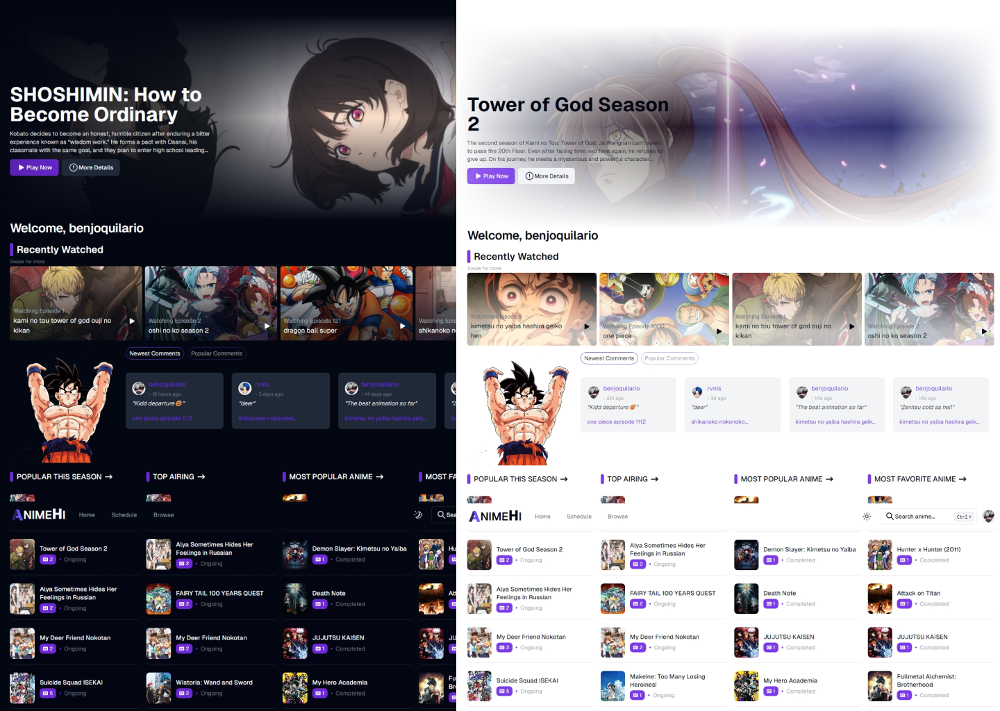
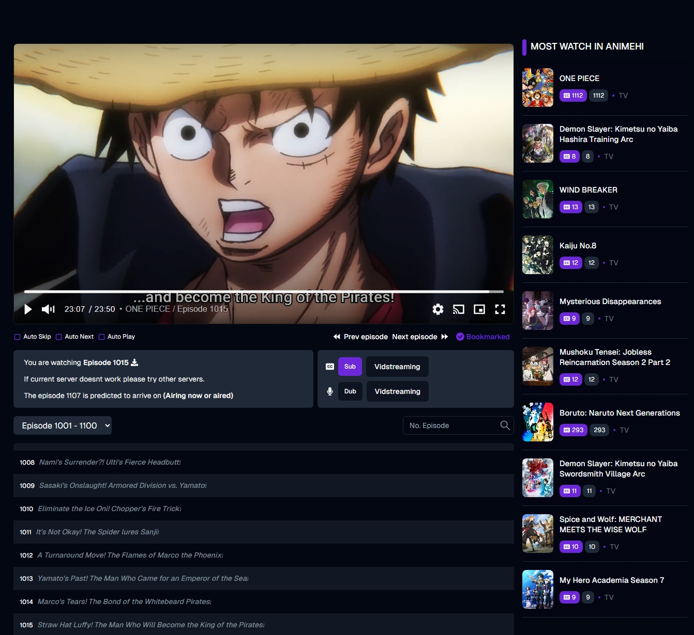
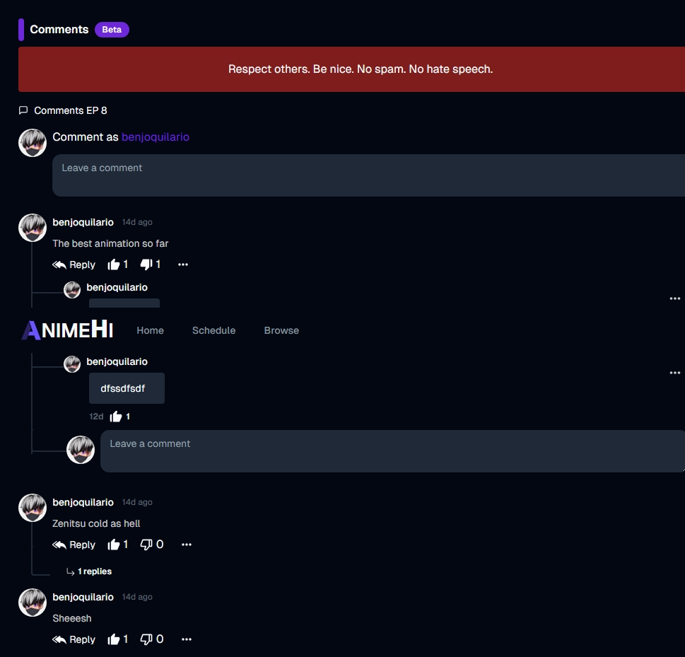

<p align="center">
  <div align="center">
    <a href="https://animehi-stream.vercel.app/">
      
    </a>
    <a href="https://animehi-stream.vercel.app/" style="margin-left: -10px">
      
    </a>
  </div>
    <h3 align="center">AnimeHi - Watch animes without ads</h3>
</p>
<p align="center">
    AnimeHi is an open-source anime streaming service that uses the consumet API, built using NextJS with typescript and Tailwind CSS. It lets you search, watch animes without any ads with a beautiful user interface.
 </p>

<p align="center">
  <a href="https://github.com/benjoquilario/animehi-stream">
      
    </a>
    <a href="https://www.gnu.org/licenses/agpl-3.0.en.html">
      
    </a>
     <a href="https://github.com/benjoquilario/animehi-stream">
      
    </a>
</p>

</br>
  <hr />
<p align="center">
  <a href="https://nextjs.org">
    
  </a>
  <a href="https://tailwindcss.com/">
    
  </a>
  <a href="https://17.reactjs.org/">
    
  </a>
  <a href="https://redux-toolkit.js.org/">
    
  </a>
  <a href="https://tailwindcss.com/">
    
  </a>
  <a href="https://www.framer.com/motion">
    
  </a>
</p>

## Screenshots

<div style="text-align: left;">
  
  <details>
  <summary>Screenshots [View More]</summary>
  <br>

### Watch Page

Watch your favorite anime for free


### Comments

Share your thought in episode


  </details>
</div>

Try the App: [AnimeHI](https://animehi-stream.vercel.app/)

### Acknowledgements

<p align="center">
<a href="https://github.com/vidstack">
    
  </a>
  <a href="https://github.com/consumet/">
    
  </a>
  <a href="https://anilist.co">
    
  </a>
</p>

This app would not have been possible without the kind and rapid support of the experts over at [Consumet](https://github.com/consumet/). AnimeHI was built using the Consumet API to supply 99% of the data.

### Features

- Watch Animes without ads
- Stay up to date with the latest anime trends
- Search your favorite Anime
- Recently release Anime
- All time popular Anime list
- All time favorite Anime list
- Favorite this season
- Airing Scheduled
- Bookmark Anime
- Continue Watching
- AutoNext/AutoPlay/AutoSkip features
- Fully Responsive
- Login/Register Account
- ...enough talk [see it yourself](https://animehi-stream.vercel.app/)

### Coming Features

- Authorization system with anilist
- <s>Watch list</s> ✅
- <s>Recently Watching</s> ✅
- <s>PWA</s>✅
- <s>Advance Search and filter genres</s>✅
- <s>Dark more</s>✅
- <s>Comments</s>✅
- <s>Reply Comment</s>✅
- <s>Like/Dislike Comment/Replies</s>✅
- Own domain name
- … and many more

## Installation and Local Development

### 1. Clone this repository using

```bash
git clone https://github.com/benjoquilario/animehi-stream.git
```

```bash
cd animehi-stream
```

### 2. Install Dependencies

- You can use Bun to install dependencies quickly. If you prefer, `npm` / `yarn` or `pnpm` can also be used with equivalent commands.

```bash
bun install
```

### Copy `.env.example` into `.env` in the root folder

- `.env.local` & `.env` are both viable options, you can also set
  `.env.test.local`,
  `.env.development.local` or
  `.env.production.local`

```bash
cp .env.example .env.local
```

### 3. Sync your database

- Create a database instance in neon.tech

```bash
npx prisma migrate dev
```

### 4. Run on development &/or production

- Run on development mode

```bash
bun run dev
```

- Run on production mode

```bash
bun run preview
```

You are all set! Open [localhost:3000](http://localhost:3000/) to see the app.

> [!NOTE]
> This project is a work in progress, it still contains bugs and will constantly be updated to stay up-to-date with the latest framework changes.

## Self-Hosting Notice

**⚠️ RESTRICTED USE**

> [!CAUTION]
> Self-hosting this application is **strictly limited to personal use only**. Commercial utilization is **prohibited**, and the inclusion of advertisements on your self-hosted website may lead to serious consequences, including **potential site takedown measures**. Ensure compliance to avoid any legal or operational issues.

## License 📝

This project is governed by a Custom BY-NC License. What does this entail? Simply put, you are permitted to utilize, distribute, and modify the code for non-commercial purposes. However, it is imperative that due credit is accorded to our platform, [animehi-stream](https://www.animehi-stream.vercel.app). Any commercial utilization of this code is strictly prohibited. For comprehensive details, please refer to the [LICENSE](LICENSE) file. Should you have inquiries or require special permissions, do not hesitate to contact us.

## Contribution

Your ideas, translations, design changes, code cleaning, real heavy code changes, or any help are always welcome. The more is the contribution, the better it gets.

[Pull requests](https://github.com/benjoquilario/anime-stream/pulls) will be reviewed
.
## Author

### Benjo Quilario

- Twitter: [@iambenjo](https://twitter.com/iam_benjo)
- Github: [@benjoquilario](https://github.com/benjoquilario)
- Portfolio: [@benjoquilario](https://benjoquilario.site)

Please give this repository a ⭐️ if you liked this app. It seems like a little thing, but it helps a lot with the motivation.
